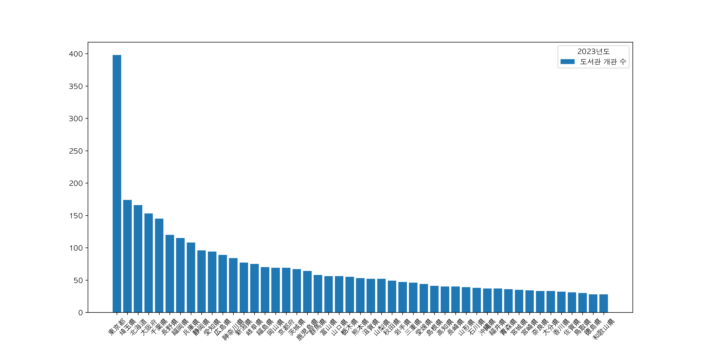

# 전제

## 1. 도쿄가 일본의 수도가 된 배경

1603년 도쿠가와 이에야스가 에도 막부를 세우면서 에도가 정치 중심지가 되었다.

하지만 그 당시 천황은 교토에 계속 있었고 수도를 그저 에도로 형식상 선언한 것 뿐이었다. 

천황은 그저 상징적 존재이고 힘이 없었다는 것을 알 수 있다.

에도를 기준으로 일본의 통치가 이루어지면서 큰 도시로 성장하게 된다.

1853년 페리 제독의 흑선이 우라가에 내항하고 서양에게 압박을 받기 시작하자 근대 국가로써의 인식이 강화된다.

1868년 메이지 유신이 일어나면서 에도 막부는 무너지기 시작했다.

이때부터 천황 중심의 중압집권 국가로 돌아가기 시작했으며 대정봉환이 일어났다.
* 대정봉환: 천황에게 권력을 돌려줌

이때부터 에도는 도쿄로 이름을 바꾸게 된다.

1869년 메이지 천황이 교토에서 도쿄로 이동하게 되고 정부기관도 잇따라 이동하게 된다.

이때부터 도쿄가 실질적으로 일본의 수도 역할을 하게 되었다.

도쿄는 현재까지 정치, 경제, 군사의 중심지로 발전하며 일본의 공식 수도처럼 자리를 잡게 되었다.

## 2. 도쿄에 도서관이 많아진 배경

에도 시대에 전국의 다이묘들은 에도에 저택을 가지고 있었다.

그 이유는 산킨코타이 때문에 다이묘들이 에도에 거주해야 했기 때문이다.
* 산킨코타이: 기간 마다 다이묘들이 에도에 올라와 살아야 하는 제도

하지만 메이지 유신이 일어난 이후 막부 체제는 무너지게 되었고 다이묘와 사무라이 계급이 자연스럽게 사라지게 되었다.

메이지 천황 정부는 다이묘와 사무라이가 사용하던 땅을 학교, 공원, 도서관 등 공공시설로 활용했다.

그렇게 오늘날의 도쿄는 수도로써 많은 공원과 도서관을 가지게 되었다.

# 조사 결과

위 전제의 결과, 도쿄는 도서관과 공원의 수가 증가하게 되었으며 주피터 노트북으로 도서관 통계 자료(2023)를 pandas, matplotlib을 

통해 분석한 결과 도쿄에 가장 많은 도서관이 개관되어 있음을 알 수 있었다.

